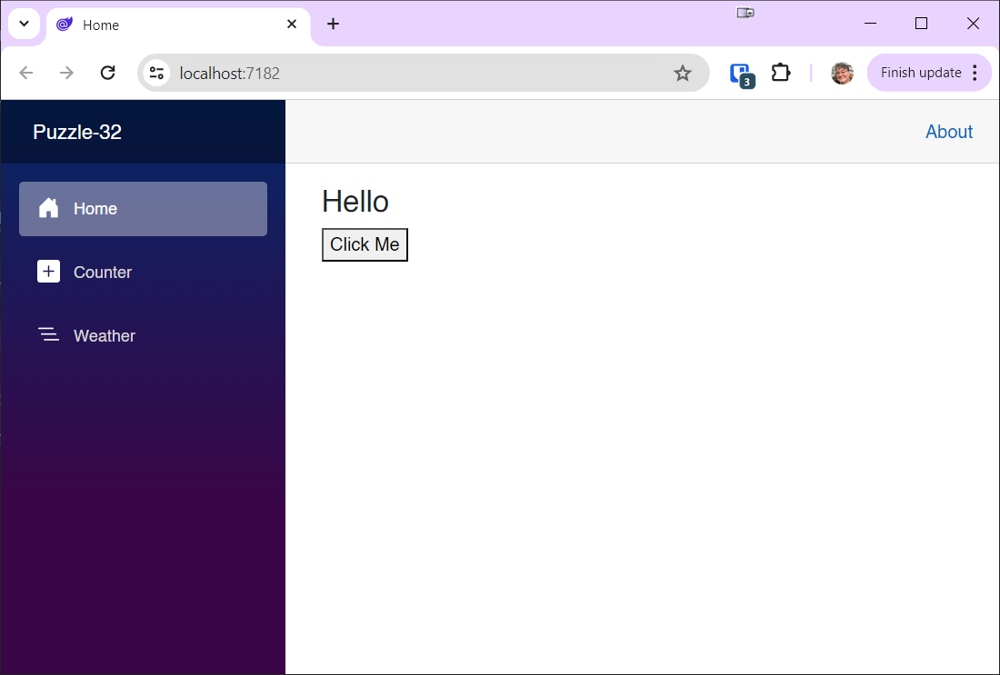

# Blazor Puzzle #32

## Updating Parameters

YouTube Video: https://youtu.be/8bu_goivWRY

Blazor Puzzle Home Page: https://blazorpuzzle.com

### The Challenge:

We want to know why changing a component’s parameter value doesn’t work.

Starting with a .NET 8 Blazor Web App in Global Server interactive mode, we added a component called `Component`:

*Component.razor*:

```c#
<h3>@Title</h3>

@code {

    // Why doesn't changing the title update the UI?
    [Parameter]
    public string Title { get; set; }
}
```

The home page shows the component and handles a button click:

*Home.razor*:

```c#
@page "/"

<PageTitle>Home</PageTitle>

<Component @ref=component Title="Hello" />

<button @onclick="ClickMe">Click Me</button>

@code {

    Component component;

    private void ClickMe()
    {
        // changing the title doesn't update the UI. Why?

        // See the component.razor file for the solution
        component.Title = $"Updated at {DateTime.Now.ToLongTimeString()}";
    }
}
```

The problem is that the component does not update when you click the button:



What's going on and how can we fix it?

### The Solution:

The problem is that Blazor doesn't consider a change to a parameter of type string, or any other reference type, enough of a change to re-render the component. 

The solution is to implement a complete property handler in the component, and call `StateHasChanged()` in the setter:

*Component.razor*:

```c#
<h3>@Title</h3>

@code {

    private string _title;

    [Parameter]
    public string Title
    {
        get => _title;
        set { _title = value; StateHasChanged(); }
    }
}
```

